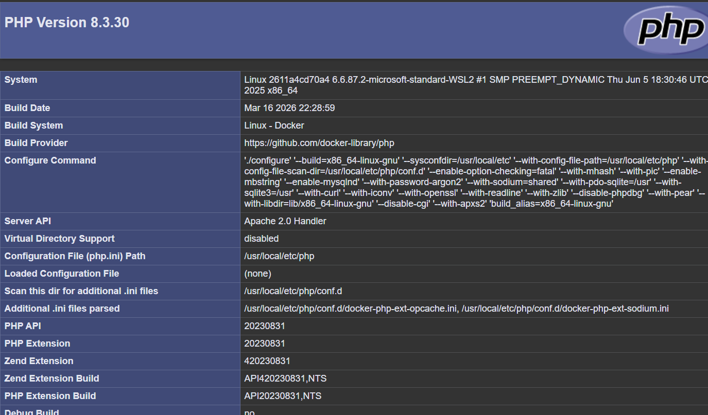

## Jour1 - Job1

### 1) Verifier la version Docker

```bash
docker --version
```

Resultat observe:

```text
Docker version 29.2.1, build a5c7197
```

### 2) Tester les commandes de base

```bash
docker info
docker ps
docker images
docker run
docker stop
```

Resultats observes:
- `docker info`: Docker Desktop actif (daemon OK).
- `docker ps`: aucun conteneur en cours au moment du test.
- `docker images`: images locales visibles (`jordangrindrod/mario`, `ruben60/pokemon`, puis `nginx`).
- `docker run` sans image: erreur normale (`requires at least 1 argument`).
- `docker stop` sans conteneur: erreur normale (`requires at least 1 argument`).

### 3) Recuperer une image Docker

```bash
docker pull nginx
docker images
```

Observation: l'image `nginx:latest` est bien telechargee et visible dans la liste.

### 4) Construire/lancer le conteneur Docker

Commande demandee (en remplaçant `xxxx` par un port valide, ici `8080`):

```bash
docker run -it --rm -p 8080:80 --name exo-nginx nginx
```

Acces navigateur:

```text
http://localhost:8080
```

Verification effectuee: code HTTP `200` recu.

Relance des commandes de base dans le terminal:

```bash
docker --version
docker info
docker ps
docker images
docker run
docker stop exo-nginx
```

### 5) Arreter le conteneur

```bash
docker stop exo-nginx
```

### 6) Supprimer le conteneur

Si lance avec `--rm`, il est supprime automatiquement a l'arret.

Sinon, commande manuelle:

```bash
docker rm exo-nginx
```

### 7) Supprimer l'image Docker

```bash
docker rmi nginx
```

### 8) Exemples de commandes de suppression

Un conteneur specifique:

```bash
docker rm mon_conteneur
```

Plusieurs conteneurs:

```bash
docker rm conteneur1 conteneur2 conteneur3
```

Tous les conteneurs arretes:

```bash
docker container prune -f
```

Forcer la suppression d'un conteneur actif:

```bash
docker rm -f mon_conteneur
```

Une image specifique:

```bash
docker rmi mon_image:tag
```

Plusieurs images:

```bash
docker rmi image1:tag image2:tag image3:tag
```

Toutes les images inutilisees (dangling):

```bash
docker image prune -f
```

Toutes les images non utilisees (aucun conteneur ne les reference):

```bash
docker image prune -a -f
```

Forcer la suppression d'une image:

```bash
docker rmi -f mon_image:tag
```

### 9) Erreurs presentes dans les commandes de l'enonce et correction

1. `docker run -it --rm -p xxxx:80 “nom de l’image”`
Correction:

```bash
docker run -it --rm -p 8080:80 nom_image
```

Details:
- `xxxx` doit etre remplace par un vrai port (ex: `8080`).
- Les guillemets typographiques `“ ”` ne sont pas valides en terminal.
- `nom de l'image` doit etre le vrai nom d'image (ex: `nginx`).

2. `docker run` seul et `docker stop` seul sont incomplets.
Corrections minimales:

```bash
docker run nginx
docker stop exo-nginx
```

3. L'enonce dit "Construisez le container Docker" mais la commande fournie est un lancement (`docker run`), pas une construction d'image.
Si l'objectif est de construire une image, la commande attendue est:

```bash
docker build -t mon_image .
```

## Jour1 - Job2

docker run -idt -p 4545:8080 jordangrindrod/mario

puis aller sur http://192.168.10.136:4545/ pour voir le résultat :


## Jour2 - Job1:

Créer l’image Docker

`docker build -t mon-apache-php `

Créer le conteneur (sans le démarrer)

`docker create --name mon-apache -p 8080:80 mon-apache-php`

Démarrer le conteneur

`docker start mon-apache`

tu as ce résultat en allant sur http://localhost:8080/ :



puis :

`docker stop mon-apache`