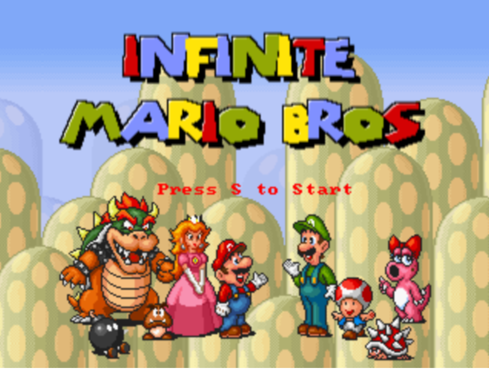

# Job 2 - Lancer l'image Mario

Image du resultat:



Commande:

```bash
docker run -idt -p 4545:8080 jordangrindrod/mario
```

Puis aller sur:

```text
http://192.168.10.136:4545/
```

Le service doit s'afficher dans le navigateur.
